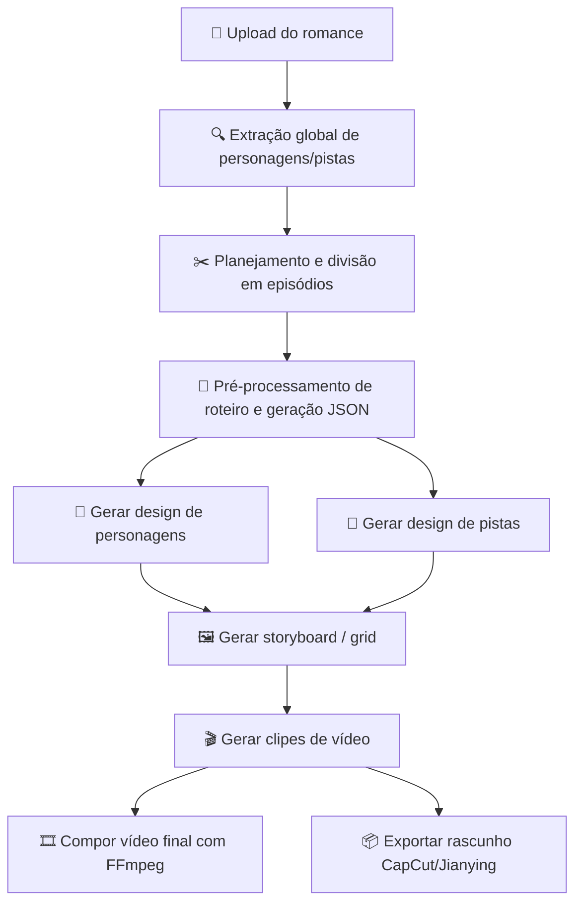
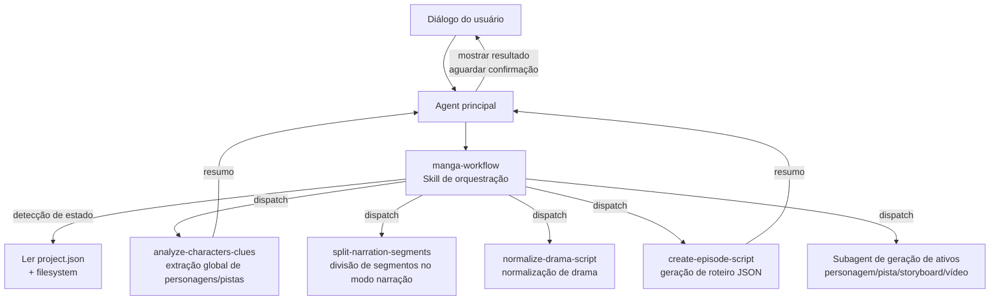
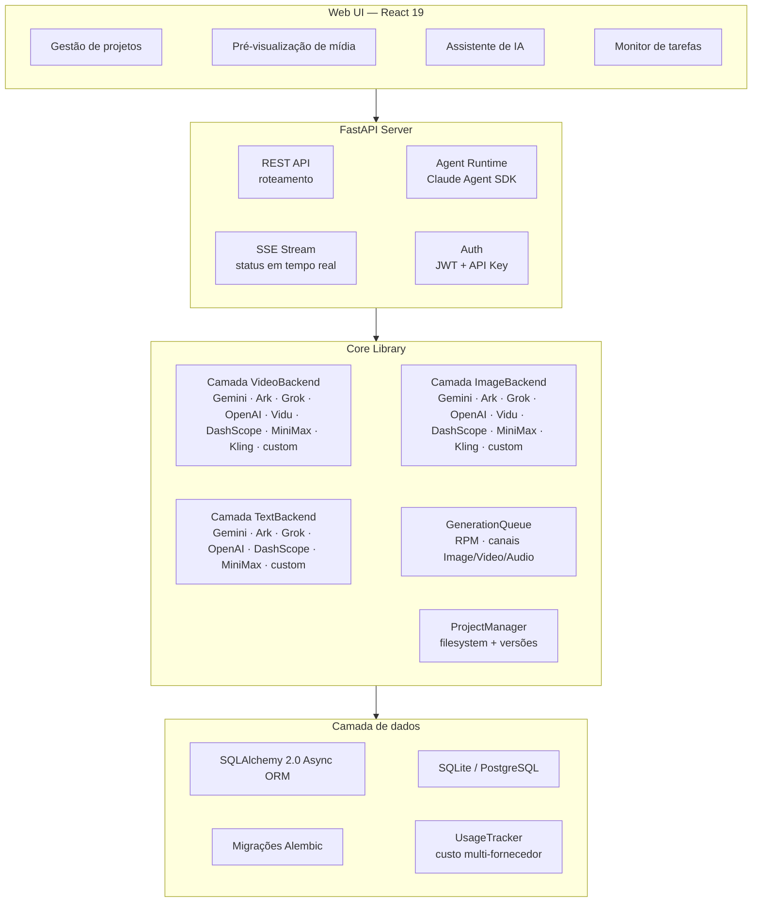

<h1 align="center">
  <br>
  <picture>
    <source media="(prefers-color-scheme: light)" srcset="frontend/public/android-chrome-maskable-512x512.png">
    <source media="(prefers-color-scheme: dark)" srcset="frontend/public/android-chrome-512x512.png">
    
  </picture>
  <br>
  ArcReel
  <br>
</h1>

<h4 align="center">Estação de trabalho open source de geração de vídeo com IA — do romance ao short video, com fluxo completo orquestrado por AI Agent</h4>

<p align="center">
  <a href="README.md"></a>
  <a href="README.en.md"></a>
</p>

<p align="center">
  <a href="#início-rápido"></a>
  <a href="https://github.com/ArcReel/ArcReel/blob/main/LICENSE"></a>
  <a href="https://github.com/ArcReel/ArcReel"></a>
  <a href="https://github.com/ArcReel/ArcReel/pkgs/container/arcreel"></a>
  <a href="https://github.com/ArcReel/ArcReel/actions/workflows/test.yml"></a>
  <a href="https://codecov.io/gh/ArcReel/ArcReel"></a>
  <a href="https://github.com/ArcReel/ArcReel/security/code-scanning"></a>
  <a href="https://github.com/ArcReel/ArcReel/releases/latest"></a>
</p>

<p align="center">
  
  
  
  
  
  
  
  
  
</p>

<p align="center">
  
</p>

---

## Capacidades principais

<table>
<tr>
<td width="20%" align="center">
<h3>🤖 Fluxo de trabalho AI Agent</h3>
Baseado no <strong>Claude Agent SDK</strong>, orquestra Skill + Subagents focados em colaboração multiagente, automatizando o pipeline completo da criação de roteiro à composição do vídeo
</td>
<td width="20%" align="center">
<h3>🎨 Geração de imagem multi-fornecedor</h3>
<strong>Gemini</strong>, <strong>Volcengine Ark</strong>, <strong>Grok</strong>, <strong>OpenAI</strong>, <strong>Vidu</strong>, <strong>Alibaba DashScope</strong>, <strong>MiniMax</strong>, <strong>Kling</strong> e fornecedores customizados; design de personagens garante consistência, rastreio de pistas mantém props/cenas coerentes entre takes
</td>
<td width="20%" align="center">
<h3>🎬 Geração de vídeo multi-fornecedor</h3>
<strong>Veo 3.1</strong>, <strong>Seedance</strong>, <strong>Grok</strong>, <strong>Sora 2</strong>, <strong>Vidu Q3</strong>, <strong>Alibaba DashScope</strong>, <strong>MiniMax</strong>, <strong>Kling</strong> e fornecedores customizados, comutáveis em nível global/projeto
</td>
<td width="20%" align="center">
<h3>⚡ Fila de tarefas assíncrona</h3>
Limite de taxa RPM + canais de concorrência independentes Image/Video/Audio, agendamento lease-based, com suporte a retomada após interrupção
</td>
<td width="20%" align="center">
<h3>🖥️ Estação visual</h3>
Web UI para gerenciar projetos, pré-visualizar mídia, reverter versões, acompanhar tarefas em tempo real via SSE, com assistente de IA embutido
</td>
</tr>
</table>

## Fluxo de trabalho



## Início rápido

> ⚠️ **Sistema operacional**: recomenda-se Linux / macOS / WSL2 / Docker. No Windows nativo é possível criar projetos e fluxos básicos, mas o sandbox Bash, bwrap e outros mecanismos de isolamento POSIX-only são rebaixados automaticamente; em produção ainda se recomenda WSL2 ou Docker Desktop

### Deploy padrão (SQLite)

```bash
git clone https://github.com/ArcReel/ArcReel.git
cd ArcReel/deploy
cp .env.example .env
docker compose up -d
# Acesse http://localhost:1241
```

### Deploy de produção (PostgreSQL)

```bash
cd ArcReel/deploy/production
cp .env.example .env    # defina POSTGRES_PASSWORD
docker compose up -d
```

Após o primeiro start, faça login com a conta padrão (usuário `admin`; a senha é definida em `.env` via `AUTH_PASSWORD`; se não for definida, é gerada no primeiro start e gravada de volta em `.env`) e vá para a **página de configurações** (`/app/settings`):

1. **Agente ArcReel** — configure as credenciais do fornecedor que impulsionam o assistente de IA; suporte a Anthropic oficial e vários fornecedores compatíveis, Base URL e modelo customizáveis
2. **Geração de imagem/vídeo/texto com IA** — configure a API Key de pelo menos um fornecedor (Gemini / Volcengine Ark / Grok / OpenAI / Vidu / Alibaba DashScope / MiniMax / Kling), ou adicione um fornecedor customizado

> 📖 Para o passo a passo completo, veja o [tutorial de introdução](docs/getting-started.md)

## Recursos

- **Pipeline completo de produção** — romance → roteiro → design de personagens → imagens de storyboard → clipes de vídeo → filme final, orquestrado em um clique
- **Arquitetura multiagente** — a Skill de orquestração detecta o estado do projeto e despacha Subagents focados; cada Subagent conclui uma tarefa e devolve um resumo
- **Runtime de Agent em sandbox** — chamadas de ferramentas do Agent rodam por padrão em sandbox bwrap; filesystem, rede e subprocessos são autorizados por whitelist; Linux/macOS habilitam automaticamente, Windows nativo rebaixa quando o sandbox não está disponível
- **Suporte multi-fornecedor** — geração de imagem/vídeo/texto com Gemini, Volcengine Ark, Grok, OpenAI, Vidu, Alibaba DashScope, MiniMax, Kling e outros pré-definidos (modais suportados variam por fornecedor), comutáveis em nível global/projeto; credenciais do assistente de IA também multi-fornecedor
- **Fornecedores customizados** — integre qualquer API compatível com OpenAI / Google (Ollama, vLLM, proxies de terceiros), descubra modelos automaticamente e atribua tipos de mídia, com as mesmas capacidades dos pré-definidos
- **Três modos de conteúdo** — modo narração (`narration`) divide por ritmo de leitura; modo drama animado (`drama`) organiza por cena/diálogo; modo anúncio/curta (`ad`) gera takes de venda por duração-alvo, um episódio → um vídeo
- **Três modos de geração de vídeo** — imagem→vídeo (storyboard-driven) / grid→vídeo (vários storyboards em grid_4/6/9 como frames inicial/final) / referência→vídeo (gera vídeo direto das imagens de ativos character/scene/prop, sem etapa de storyboard)
- **Várias fontes de roteiro** — adapte a partir do romance original ou importe um roteiro finalizado (screenplay): preserve falas e voice-over literalmente, extraia personagens da tabela de elenco do autor, extras e planos vazios não viram ativos
- **Projetos de anúncio/curta** — tipo de projeto para shorts de venda: upload de várias fotos do produto e geração de referência padrão, script de takes em oito seções em um clique, takes de produto ancorados no produto real, exportação CapCut/Jianying com trilha de legendas de locução
- **Narração por voz (TTS)** — configure timbre e velocidade na página de settings; ouça por segmento, complete o episódio em um clique, ou peça ao agente em uma frase; suporte a Alibaba DashScope Qwen3 TTS e qualquer TTS compatível com OpenAI; exportação CapCut/Jianying inclui trilha de narração por segmento
- **Planejamento progressivo de episódios** — divisão colaborativa de romances longos: planeje um lote de episódios com arco completo, o Agent sugere cortes, o usuário confirma a divisão física, um comentário reordena o lote, produza sob demanda
- **Imagem de referência de estilo** — faça upload de uma imagem de estilo; a IA analisa e aplica a todas as gerações de imagem, garantindo consistência visual no projeto
- **Consistência de personagens** — a IA gera primeiro o design do personagem; todos os storyboards e vídeos posteriores referenciam esse design
- **Rastreio de pistas** — props-chave e elementos de cena marcados como “pista” mantêm coerência visual entre takes
- **Histórico de versões** — cada regeneração salva uma versão histórica com rollback em um clique
- **Rastreio de custos multi-fornecedor** — imagem/vídeo/texto entram no cálculo de custo, com estratégias por fornecedor e totais por moeda
- **Estimativa de custo** — estime custo de projeto/episódio/take antes de gerar, com drill-down em três níveis comparando estimado vs. real
- **Exportação de rascunho CapCut/Jianying** — exportar ZIP de rascunho por episódio, CapCut/Jianying 5.x / 6+ ([guia de uso](docs/jianying-export-guide.md))
- **Gestão multi API Key** — vários API Keys por fornecedor com chave ativa comutável; upload de credenciais Google Vertex AI
- **Interface multilíngue** — i18n completo no front e back, com troca de idioma
- **Importação/exportação de projeto** — empacote o projeto inteiro para backup e migração

## Suporte a fornecedores

O ArcReel unifica os protocolos `ImageBackend` / `VideoBackend` / `TextBackend`, com vários fornecedores pré-definidos e customizados, comutáveis em nível global ou de projeto:

### Fornecedores de imagem

| Fornecedor | Modelos disponíveis | Capacidades | Cobrança |
|--------|----------|------|----------|
| **Gemini** (Google) | Nano Banana 2, Nano Banana Pro | text-to-image, image-to-image (múltiplas refs) | Tabela por resolução (USD) |
| **Volcengine Ark** | Seedream 5.0, Seedream 5.0 Lite, Seedream 4.5, Seedream 4.0 | text-to-image, image-to-image | Por imagem (CNY) |
| **Grok** (xAI) | Grok Imagine Image, Grok Imagine Image Pro | text-to-image, image-to-image | Por imagem (USD) |
| **OpenAI** | GPT Image 2 | text-to-image, image-to-image (múltiplas refs) | Por token (USD) |
| **Vidu** | Vidu Q2 Image, Vidu Q1 Image | text-to-image, image-to-image | Créditos convertidos (CNY) |
| **Alibaba DashScope** | Qwen Image 2.0 / Pro, Qwen Image Edit Plus / Max, Wanxiang 2.7 Image / Pro | text-to-image, image-to-image | — |
| **MiniMax** | MiniMax Image 01 | text-to-image, image-to-image (ref de rosto único) | — |
| **Kling** (Kuaishou) | Kling Image O1, Kling V3-Omni Image | text-to-image, image-to-image | — |

### Fornecedores de vídeo

| Fornecedor | Modelos disponíveis | Capacidades | Duração (s) | Cobrança |
|--------|----------|------|-----------|----------|
| **Gemini** (Google) | Veo 3.1, Veo 3.1 Fast, Veo 3.1 Lite | text-to-video, image-to-video, extensão de vídeo, negative prompt | 4 / 6 / 8 | Resolução × duração (USD) |
| **Volcengine Ark** | Seedance 2.0, Seedance 2.0 Fast, Seedance 1.5 Pro | text-to-video, image-to-video, extensão, áudio, seed, offline | 4–15 | Por token (CNY) |
| **Grok** (xAI) | Grok Imagine Video | text-to-video, image-to-video | 1–15 | Por segundo (USD) |
| **OpenAI** | Sora 2, Sora 2 Pro | text-to-video, image-to-video | 4 / 8 / 12 | Por segundo (USD) |
| **Vidu** | Vidu Q3 Turbo, Vidu Q3 Pro, Vidu Q3 (Reference), Vidu 2.0 | text-to-video, image-to-video, reference-to-video, áudio, seed | 1–16 (ref 3–16; 2.0: 4 / 8) | Créditos convertidos (CNY) |
| **Alibaba DashScope** | HappyHorse 1.0 (img/text/ref→vídeo), Wanxiang 2.7 (img/text/ref→vídeo) | text-to-video, image-to-video, reference-to-video, áudio, seed | 2–15 | — |
| **MiniMax** | MiniMax Hailuo 2.3 / 2.3 Fast, MiniMax S2V-01 | text-to-video, image-to-video, ref de rosto único | 6 / 10 (S2V-01: 6) | — |
| **Kling** (Kuaishou) | Kling 2.5 Turbo, Kling v3, Kling v3 Omni, Kling v2.6, Kling Video O1 | text-to-video, image-to-video, reference-to-video, áudio | 5 / 10 (v3 · Omni: 3–15) | — |

### Fornecedores de texto

| Fornecedor | Modelos disponíveis | Capacidades | Cobrança |
|--------|----------|------|----------|
| **Gemini** (Google) | Gemini 3.1 Pro, Gemini 3 Flash, Gemini 3.1 Flash Lite | texto, structured output, visão | Por token (USD) |
| **Volcengine Ark** | Doubao Seed 2.0 Pro / Lite / Mini, Doubao Seed 1.8 | texto, structured output, visão | Por token (CNY) |
| **Grok** (xAI) | Grok 4.20 Reasoning / Non-Reasoning, Grok 4.1 Fast Reasoning / Non-Reasoning | texto, structured output, visão | Por token (USD) |
| **OpenAI** | GPT-5.5, GPT-5.4, GPT-5.4 Mini, GPT-5.4 Nano | texto, structured output, visão | Por token (USD) |
| **Alibaba DashScope** | Qwen Plus, Qwen3.6 Plus / Flash, Qwen3 Max, Qwen3.7 Max, Qwen Long | texto, structured output | — |
| **MiniMax** | MiniMax M3, MiniMax M2.7 | texto, structured output | — |

### Fornecedores customizados

Além dos pré-definidos, integre qualquer API **compatível com OpenAI** ou **compatível com Google**:

- Na página de settings, adicione um fornecedor customizado com Base URL e API Key
- Descoberta automática via `/v1/models`, inferindo tipo de mídia (imagem/vídeo/texto) pelo nome
- Mesmas capacidades dos pré-definidos: comutação global/projeto, rastreio de custo, gestão de versões

Prioridade de seleção: config do projeto > padrão global. Ao trocar de fornecedor, settings genéricas (resolução, aspect ratio, áudio etc.) são reaproveitadas; parâmetros específicos do fornecedor são preservados.

## Comunidade

Escaneie o QR para entrar no grupo Feishu e obter ajuda e novidades:

<p align="center">
  
</p>

## Arquitetura do assistente de IA

O assistente de IA do ArcReel é construído sobre o Claude Agent SDK, com arquitetura multiagente de **Skill de orquestração + Subagents focados**:



**Princípios de design**:

- **Skill de orquestração (manga-workflow)** — detecta o estágio do projeto (design de personagens / planejamento de episódios / pré-processamento / geração de roteiro / geração de ativos), despacha o Subagent correspondente, permite entrar em qualquer estágio e retomar após interrupção
- **Subagent focado** — cada Subagent conclui uma tarefa e retorna; o romance e outros contextos grandes ficam dentro do Subagent; o Agent principal só recebe resumos refinados, protegendo o espaço de contexto
- **Fronteira Skill vs Subagent** — Skill executa scripts determinísticos (chamadas de API, geração de arquivos); Subagent faz tarefas que exigem raciocínio (extração de personagens, normalização de roteiro)
- **Confirmação entre estágios** — após cada Subagent retornar, o Agent principal mostra o resumo e aguarda confirmação antes do próximo estágio

## Integração OpenClaw

O ArcReel pode ser chamado por plataformas externas de AI Agent como [OpenClaw](https://openclaw.ai), para criação de vídeo guiada por linguagem natural:

1. Gere uma API Key na página de settings do ArcReel (prefixo `arc-`)
2. Carregue a definição de Skill do ArcReel no OpenClaw (acesse `http://your-domain/skill.md` para obter automaticamente)
3. Via diálogo no OpenClaw, crie projetos, gere roteiros e produza vídeos

Implementação: autenticação por API Key (Bearer Token) + endpoint síncrono de chat do Agent (`POST /api/v1/agent/chat`), que internamente usa o assistente SSE e devolve a resposta completa.

## Arquitetura técnica



## Stack técnica

| Camada | Tecnologia |
|------|------|
| **Frontend** | React 19, TypeScript, Tailwind CSS 4, wouter, zustand, Framer Motion, Vite |
| **Backend** | FastAPI, Python 3.12+, uvicorn, Pydantic 2 |
| **AI Agent** | Claude Agent SDK (arquitetura multiagente Skill + Subagent) |
| **Geração de imagem** | Gemini (`google-genai`), Volcengine Ark (`volcengine-python-sdk[ark]`), Grok (`xai-sdk`), OpenAI (`openai`), Vidu / DashScope / MiniMax / Kling (`httpx`) |
| **Geração de vídeo** | Gemini Veo 3.1 (`google-genai`), Volcengine Ark Seedance 2.0/1.5 (`volcengine-python-sdk[ark]`), Grok (`xai-sdk`), OpenAI Sora 2 (`openai`), Vidu Q3 / DashScope / MiniMax Hailuo / Kling (`httpx`) |
| **Geração de texto** | Gemini (`google-genai`), Volcengine Ark (`volcengine-python-sdk[ark]`), Grok (`xai-sdk`), OpenAI (`openai`), DashScope / MiniMax (`httpx`), Instructor (fallback de structured output) |
| **Narração (TTS)** | Alibaba DashScope Qwen3 TTS (`httpx`), qualquer TTS compatível com OpenAI (fornecedor customizado) |
| **Processamento de mídia** | FFmpeg, Pillow |
| **ORM e banco** | SQLAlchemy 2.0 (async), Alembic, aiosqlite, asyncpg — SQLite (padrão) / PostgreSQL (produção) |
| **Auth** | JWT (`pyjwt`), API Key (hash SHA-256), hash de senha Argon2 (`pwdlib`) |
| **Deploy** | Docker, Docker Compose (`deploy/` padrão, `deploy/production/` com PostgreSQL) |

## Documentação

- 📖 [Tutorial completo de introdução](docs/getting-started.md) — guia passo a passo do zero
- 📦 [Guia de exportação CapCut/Jianying](docs/jianying-export-guide.md) — importar clipes no CapCut/Jianying desktop para edição secundária
- 💰 [Custos Google GenAI](docs/google-genai-docs/Google视频&图片生成费用参考.md) — referência de preço Gemini imagem / Veo vídeo
- 💰 [Custos Volcengine Ark](docs/ark-docs/火山方舟费用参考.md) — referência de preço Ark vídeo / imagem / texto

## Contribuindo

Contribuições de código, reportes de bugs e sugestões de features são bem-vindas! Veja o [guia de contribuição](CONTRIBUTING.md) para setup local, testes e padrões de código.

Após clonar, execute uma vez:

```bash
uv run pre-commit install
```

Isso instala os hooks pre-commit (ruff check + format, frontend eslint, workflow tripwire), evitando que problemas auto-corrigíveis cheguem ao CI.

## 📜 Licença

Este projeto é licenciado sob a [GNU Affero General Public License v3.0 (AGPL-3.0)](./LICENSE),
com termos adicionais em [NOTICE](./NOTICE).

Copyright © 2026 Pollo3470 and ArcReel contributors

Se a política da sua organização não permite software sob AGPL-3.0, ou se você deseja uso comercial
sem as obrigações de open source da AGPL-3.0, entre em contato: [support@arc-reel.com](mailto:support@arc-reel.com)

---

<p align="center">
  Se o projeto for útil, deixe uma ⭐ Star!
</p>
